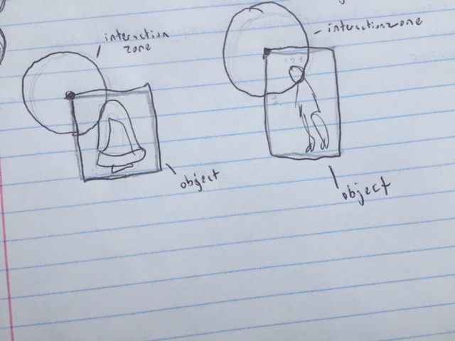
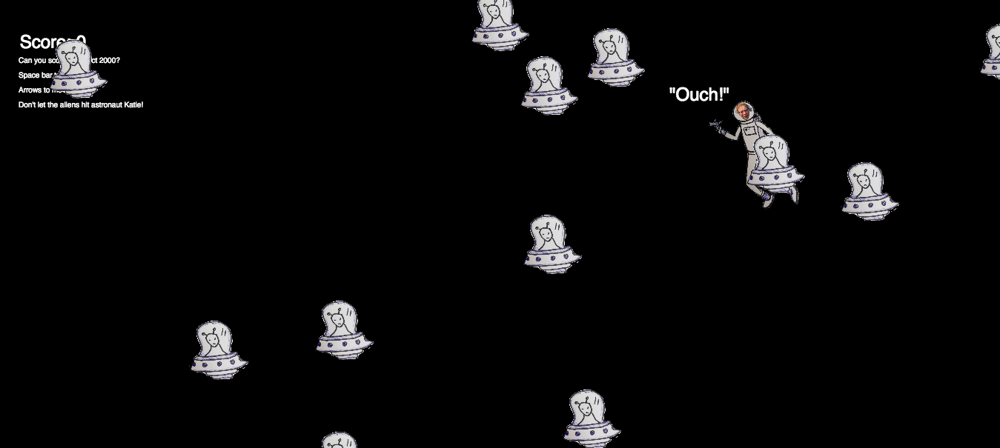

Katherine Holmgren, 50

# Katie v. Aliens Final Project

[live link](https://katholmgren.github.io/120-work/final-project/)

Originally, I intended to make a replica of asteroids with a robot instead of a ship and aliens instead of asteroids. Instead, I ended up with an astronaut version of myself and twenty hand drawn aliens. This idea came late at night when I thought to myself at 3am, "I should photoshop my face into it and have myself shoot all my final exams". I didn't stick with the finals exams idea, but I did add myself to it. Personally, I'm glad I did because I think it's a lot funnier and enjoyable to play for those who know me (and those who don't). Its more personal and has more of a story than if I had just used a robot image I found online. The images I drew also add to its humor and its "homemade" feeling. I'm quite proud of the result.

This project took a lot of time and energy. Shoutout to Emily Griffin for helping me with so many errors. Also Dan Shiffman, who I don't know, but whose youtube videos I watched repeatedly throughout this process.

Helpful links I used through this process:

[Shiffman asteroids](https://www.youtube.com/watch?v=hacZU523FyM&t=1673s)

[Shiffman space invaders](https://www.youtube.com/watch?v=biN3v3ef-Y0)

[Shiffman asteroids code](https://github.com/CodingTrain/Asteroids)

[Asteroids game online](http://www.onemotion.com/flash/asteroids-game/)

[p5.js reference page](https://p5js.org/reference/#group-Image)

## Process

I started with a robot image I found online. I made a Class for it and made it respond to the arrow keys. After getting that far, I had my idea to use myself instead. I drew the astronaut and alien sketches, took pictures of them, then uploaded them to my computer. I haven't taken a photoshop class yet and I didn't have the program, so I used Krita which is a free drawing/photoshop application. I removed the background from each and put my face on the astronaut image. Then I uploaded it to my sketch. It worked well.

Then I tried to get the alien to move. I had problems with this because nothing would show up in my browser and the console wouldn't show any errors. I talked to Emily and we went back to a previous version and found the issue. I can't remember what that was... it was like a week ago. I think it was a missing bracket in the long run.

After that, I had issues with the alien splicing. It wouldn't register. This also turned out to be a syntax error. Also discovered by Emily.

The thing that puzzled me the most about the object interaction was that the spicing was inconsistent-- both when the laser hit an alien and when the Katie astronaut hit an alien. Sometimes it would register but sometimes it wouldn't. It would also register when it wasn't supposed to. The issue behind this that I eventually discovered was that I was using object interaction for ellipse-shaped objects with centrally positioned X and Y locations instead of rectangular objects that used the X and Y position from the upper left-hand corner. This caused a mismatch in interaction zones with the actual appearance of the object.

It took longer for me than it should have to fix this issue, but it's working now.

Lastly, I worked on the score. Artistic decisions took the most time here because I didn't know how I wanted the user to "win" and how I wanted the user to "lose". I kept changing my mind. Technically, there is no "lose" now. The closest thing I have to losing is hitting an alien and not getting the full 2000 points. I didn't want to overcomplicate it.

## Issues

There are glitches with the sketch. The astronaut sometimes gets stuck on the border. It can free itself if the user presses multiple arrow keys and/or the space bar which is why I wasn't persistent on debugging it. It's also missing sound because the sound wouldn't load in Google Chrome. Since Google Chrome is such a popular browser, I decided it wasn't worth it to add sound and not have it work in Chrome. It would have been cute though-- I recorded myself saying "pew" and making funny sound effects. I might go back and add it in later if I decide it's worth it.

Another thing wrong with the sketch is the absence of lives, restart, and the "game over" screen. I spent a long time trying to figure out how this would work in my game, but it ended up taking too much time and being too complex for me to add. My substitute for this issue was to have a "winning" score. If the user runs into an alien then the Katie astronaut will say, "ouch" and the points will go back to zero. Thus, they don't win the game.

### Image

Overall, this has been a great ending to the class. It was a chance for me to use all the skills I've acquired over the semester and put them into practice all at once. It helped me review and I learned a lot. I'm also more comfortable with things we worked on in previous homework assignments. And despite all the time and frustration throughout, I had fun!
