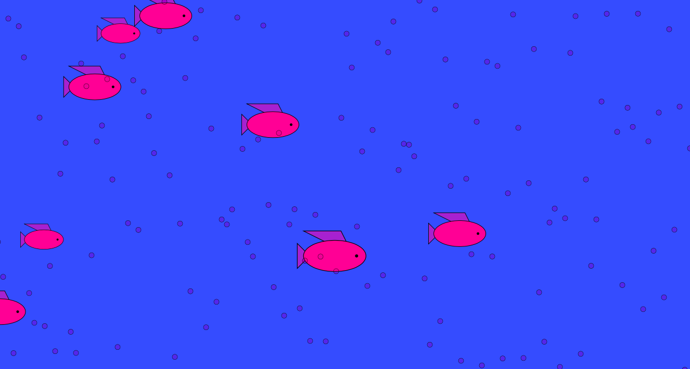

Katherine Holmgren, 50

# HW-10 School of Fish (Arrays and Defining Functions)

[hw-10 live link](https://katholmgren.github.io/120-work/hw-10/)

For this homework cycle, we were to define our own function and use an array in a sketch. I defined one function to make a fish, then I drew many fishes in the draw function block by calling the fish function in a for loop. I did this with bubbles also. I used an array to cycle the size of the fish. The ending result was eight fish appearing in random positions on the canvas with different sizes. There are also many bubbles changing location as well.

## Steps

This was very confusing for me. I originally wanted fish to move across the canvas linearly, but I couldn't figure this out in time. Instead, they just randomly appear on the canvas which I think looks fine.

After creating a big mess of code, I trimmed it down to Setup, Draw, Fish, and Bubbles functions. I called fish and Bubbles in the draw loop which made them show up. I put them in for loops which duplicated it. I added the size array last after realizing I deleted my original array because it could be replaced with a simpler function.

## Issues

I couldn't make fish move linearly across the canvas from starting at a random x position. I never figured this out, but probably could if I came back to it with more time. I think I overcomplicated this assignment too because the homework example was more difficult than what I was trying to do-- I was relying on it too much.

I got help from Emily because the fish would only show up for a second before disappearing... this was caused by many reasons, such as misused arrays and creating multiple variables to perform the same task.

## Conclusion

I would like to go over how using arrays, for loops, and my own functions interconnect with one another because I think that's what I tripped me up most this week. I like how this sketch turned out though. Maybe I'll stare at it to fall asleep.

Here is a picture of my sketch:

