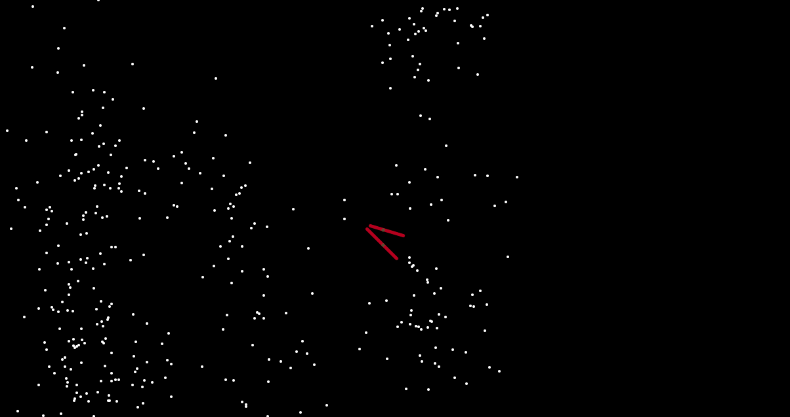

Katherine Holmgren, 50

# HW-11 Expanding Rice (Object-Oriented Programming)

[hw-11 live link](https://katholmgren.github.io/120-work/hw-11/)

For this homework cycle, we were to make a sketch using object-oriented programming. I made a class for "rice". This is basically a blueprint that makes a constructor, properties that set the visuals for the dots, and a method that makes the dots "expand". This is supposed to be rice (lol). The cursor is supposed to be chopsticks.

## Steps

I used Dan Shiffman's code's as a starting place, then played with it a lot until I had a unique sketch and understood the basics of how object-oriented programming worked. After that, I tried to make it into something-- in this case, "rice" and "chopsticks".

I tried to put the chopsticks into their own class, but I couldn't get it to work so I put them in their own function block instead. So the layout of the sketch comes down to setup, mouseDragged, draw, and the chopsticks function, then the Rice class. I would have used mousePressed, but it didn't display the rice's "history" on the canvas.

## Issues

I didn't have as much trouble with object-oriented programming as I thought I was going to have. It actually felt more organized and I could better visualize the flow of where variables were going. I did try to make a second class for the "chopsticks," but I couldn't get it to work. So instead I made them into a function.

The second issue I had was that I originally had the mouseDragged function as the mousePressed function. The problem I had with this was that I would either have rice that erased it's past every frame because the background was called in the draw loop, otherwise I would have correct rice with its "history" shown, but the past places of where the chopsticks had been displayed as well. I couldn't figure out how to draw the background twice so that it would erase for one object and not the other. By changing mousePressed to mouseDragged, I could get close enough to what I was envisioning.

## Conclusion

Object-oriented programming wasn't too bad and I'm sure I'll get more comfortable with it as I continue working with it.

Enjoy drawing with rice!

Here is a picture of my sketch:

