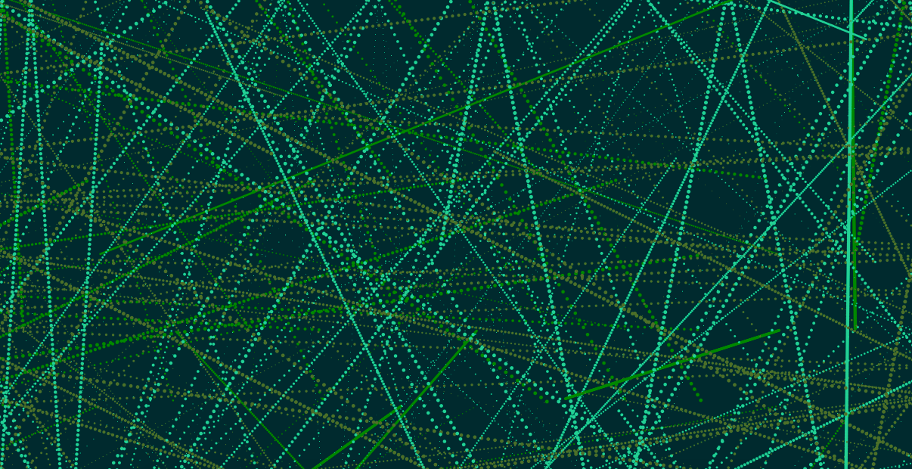

# HW-12 Object Interaction

[hw-12 live link](https://katholmgren.github.io/120-work/hw-12/)

For this homework cycle, we were to use object-oriented programming again and this time have objects interact with each other. I had a very hard time with this-- the interaction is barely even visible. On top of that, I felt very uninspired this week. I tried to make "vines" that would "grow," but I ended up with just a bunch of dotted and undotted lines. They looked kind of cool, so I just settled for that. I didn't have a problem making a separate file for the Vines class and calling it in the index, so at least there's some good in that.

## Steps

I made a class for "Vines" in its own separate file, with a constructor, display, move, edgeCheck, and vineCheck section. This was very similar to the bouncing ball sketch from class. Then I called it in the draw and setup function in the sketch.js file. The index.html file loaded both. When dots pass over other dots, they switch colors to an olive green. So while the "vines" keep switching to mint when they hit the borders, the olive green color is maintained because the colors switch upon collision.

## Issues

My only issue was that I was too lost to make anything truly original. I'm going to have to go back and review this section to understand it better so I don't get too behind in the next module.

## Conclusion

I think the idea of a coded botanical garden would be legit. Like with actual growing vines, not little moving dotted lines. I think I'll attempt this for the final project. I'll have to review this chapter so I can get there though.

Here is a picture of my sketch:

