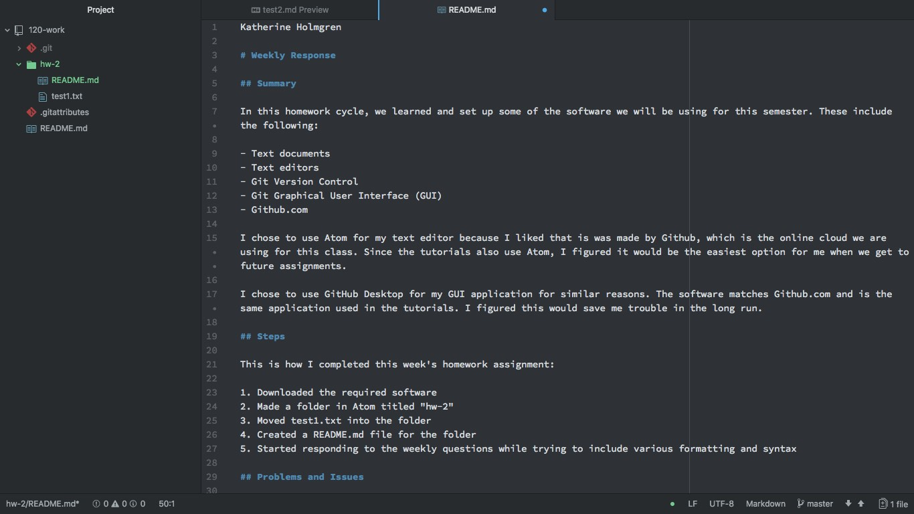
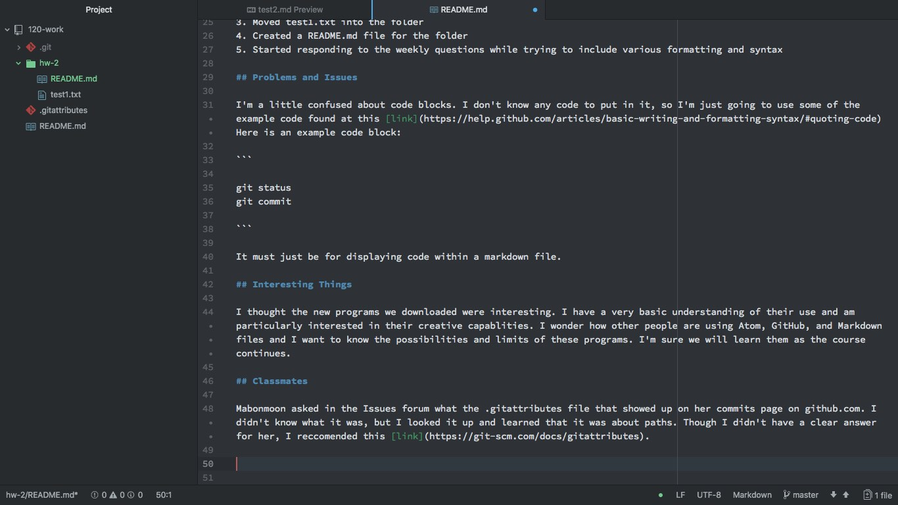

Katherine Holmgren

# Weekly Response

## Summary

In this homework cycle, we learned and set up some of the software we will be using for this semester. These include the following:

- Text documents
- Text editors
- Git Version Control
- Git Graphical User Interface (GUI)
- Github.com

I chose to use Atom for my text editor because I liked that is was made by Github, which is the online cloud we are using for this class. Since the tutorials also use Atom, I figured it would be the easiest option for me when we get to future assignments.

I chose to use GitHub Desktop for my GUI application for similar reasons. The software matches Github.com and is the same application used in the tutorials. I figured this would save me trouble in the long run.

## Steps

This is how I completed this week's homework assignment:

1. Downloaded the required software
2. Made a folder in Atom titled "hw-2"
3. Moved test1.txt into the folder
4. Created a README.md file for the folder
5. Started responding to the weekly questions while trying to include various formatting and syntax

## Problems and Issues

I'm a little confused about code blocks. I don't know any code to put in it, so I'm just going to use some of the example code found at this [link](https://help.github.com/articles/basic-writing-and-formatting-syntax/#quoting-code)  Here is an example code block:

```

git status
git commit

```

It must just be for displaying code within a markdown file.

## Interesting Things

I thought the new programs we downloaded were interesting. I have a very basic understanding of their use and am particularly interested in their creative capabilities. I wonder how other people are using Atom, GitHub, and Markdown files and I want to know the possibilities and limits of these programs. I'm sure we will learn them as the course continues.

## Classmates

Mabonmoon asked in the Issues forum what the .gitattributes file was that showed up on her commits page on github.com. I didn't know what it was, but I looked it up and learned that it was about paths. Though I didn't have a clear answer for her, I recommended this [link](https://git-scm.com/docs/gitattributes).




