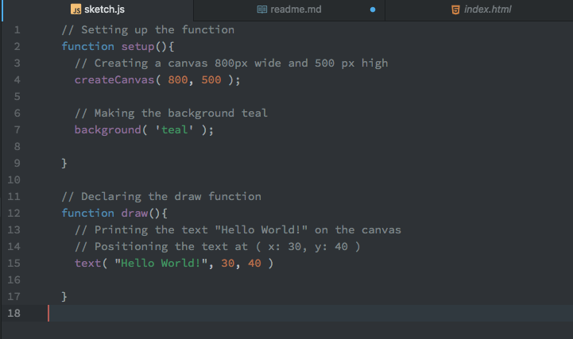
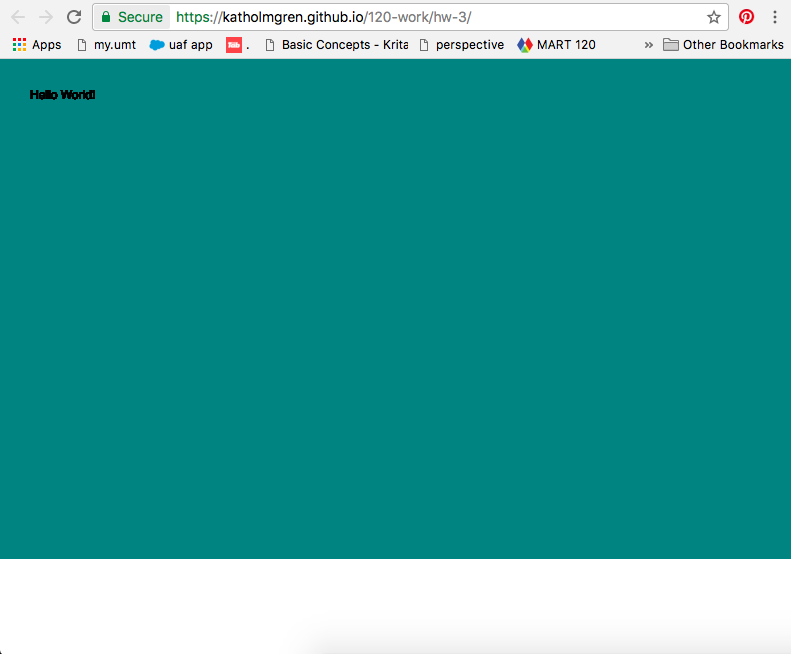

Katherine Holmgren, 50

["Hello World!"](https://katholmgren.github.io/120-work/hw-3/)

# HW-3 Response

For this week's homework, we got to use p5.js to display the text "Hello World!" on a colored canvas in a browser. I was surpised at the simplicity of displaying this information in a browser, although I suppose it has taken three weeks to get us to this point. Now that I know what more things mean and have a better understanding of how the programs work, it didn't seem overly complex to display such basic things.

## Decisions

I decided to make my canvas 800px by 500px. I remembered trying the color "teal" in one of the example code blocks on the class web page, so I decided to set my background color as that for my homework. I displayed my "Hello World!" text at 30px from the side and 40px from the top. This was all done in a sketch.js file under the function setup section and the function draw section.

Here is the image of my sketch.js file:

## Problems

I did not run into any major problems. I texted Emily a quick question about what to push to github because I had many changes in course-work files that were not committed yet. I decided to push those as well all under "course-work". Then I pushed the homework.

Other than that, I didn't have any questions about the homework and I didn't run into any problems.

## Conclusion

This homework will be displayed in my own static website hosted by github. As of February 7, none of my classmates have had any issues that need a response.

Here is a picture of what my hw-3 looks like in my browser:

