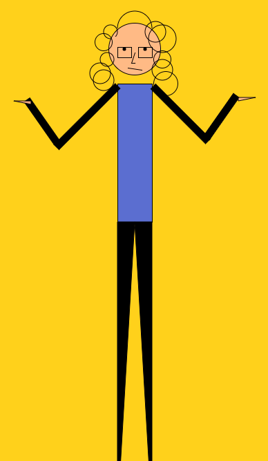

Katherine Holmgren, 50

["Self-Portrait"](file:///Users/Katie/Desktop/120-work/hw-4/index.html)

# HW-4 Response

I really enjoyed this week's homework because we got to create something from our own imagination using what we've been learning in class-- it wasn't just copying someone else's work. I found it very satisfying to type a function and have it actually work. That said, it was a little confusing when it didn't work.

## Artistic Decisions

I chose to be less abstract than the homework examples and instead go for more of a comic book style. I am very tall and slender, so I chose to exaggerate that. I'm also kind of sarcastic and goofy, so I made my expression to be in the "whatever" body stance with a little downward smirk on my face. My hair is golden blonde, and it is color that sticks out when you see me because hair is very curly and big. I made the entire background gold and the circles unfilled so the audience would associate this color with me more. It also went with the blue of my shirt-- a color I wear often.

## Problems

Rotating my arms was definitely the hardest part. My brain does not think graphically very well, so the rotate function really had to make me think since the points on the graph would not match up with the previous points from the previous graphs. I overcame this by a lot of guess and checking. Those arms traveled to every part of the canvas until I narrowed down the location. I will definitely need more practice thinking in terms of radians and degrees, and just thinking mathematically in general.

The other problem I had was with color. When I first started the piece, a color would be applied to multiple sections or wouldn't show up at all. I fixed this by changing the order around until it worked. Not the best method, I'll admit but it seemed to work.

I did not ask for help or respond to my classmates because I was able to figure out these problems on my own. I haven't replied to any problems yet because there aren't any that I can answer properly. I'm still a little confused about committing and pushing to GitHub, so I might go to lab today and ask about that.

## Conclusion

This homework was time-consuming, but I enjoyed it! It will be displayed in my own static website hosted by GitHub.

Here is my self-portrait!

