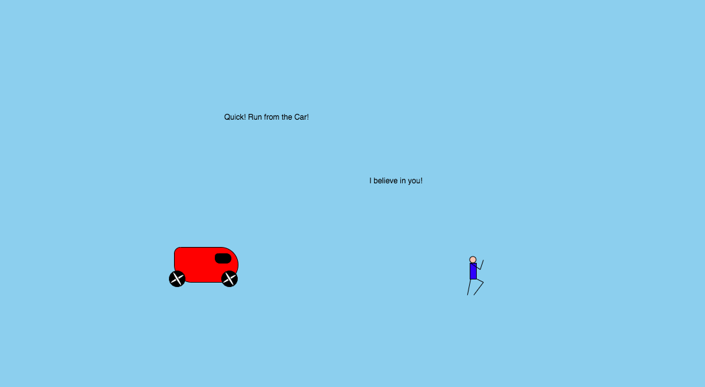

Katherine Holmgren, 50

["Run From the Car"](https://katholmgren.github.io/120-work/hw-5/)

# HW-5 Response

The majority of this week's homework was frustrating because I couldn't get my sketch to behave how I wanted. I spent a long time in trial and error and started with a pretty sloppy sketch. It took a long time to clean it up. After I figured out how to make the wheel twist instead of fly around in circles, I could approach the homework more logically and it came together fairly well.

## Decisions

I decided to make an animation of a car that moved across the x-axis at a constant rate. It would have turning wheels that would rotate at a constant rate as well. I made the person last because I needed something to move in relation to the mouse. I ended up with a very basic "game" where you have to move the person away from the car.

## Problems

I had a lot of difficulty in getting the wheels of the car to twist. They would move in large circular patterns around the car and I spent most of my time trying to figure out why. Eventually, I figured out that the ellipses weren't set on the origin. They twisted when I set both X and Y coordinates to (0,0).

Also, my sketch wouldn't open in Chrome for a while, which was strange because it had opened in the past. I posted this on the issues forum and got some advice. I ended up closing out of everything, updating my computer, updating some atom extensions, and restarting everything. It's working now.

I asked Emily some questions and she recommended using the Developer Tools, which I found helpful. She also told me I should be pushing my work to GitHub as I go, which I didn't know but makes sense. I also went to office hours just to check it out and clear up a couple questions I had about the assignment. Stephanie showed me how to make the wheels circles and still rotate, so that was helpful.

## Things I Would Like to Learn

I originally wanted to have a slug follow the mouse around the canvas and have it leave a trail of slime for the assignment. But I couldn't figure out how to have the background replace itself and also not replace itself. I think that would be cool to learn.

## Conclusion

This homework will be displayed in my own static website hosted by github.

Here is a picture of what my hw-5 looks like in my browser:

