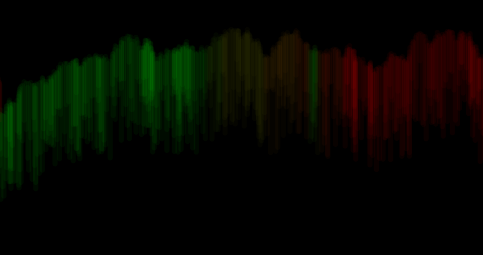

Katherine Holmgren, 50

["Aurora Borealis"](https://katholmgren.github.io/120-work/hw-6/)

# HW-6 Response

We covered a lot of information this week and it took me a while to understand it all. I loved the results though. About a week ago, I had thought, "Wow. One day I might be able to code the Northern Lights." I had no idea that would be this week. That said, they aren't exactly like the Northern Lights, but anyone who has seen the Aurora and my work would be able to recognize what I was trying to do. 

## Artistic Decisions

The easiest shape to break the Aurora is a line, so I decided to make one line and have it move across the canvas in random positions without replacing the background. I set the stroke to both green and red based on the mouse position because those are the colors most common in an average Aurora. When I made the stroke almost transparent, it gave a glowing effect which I was looking for.

I would have liked to have the lines fade over time like a natural aurora, but I wasn't sure how. Also, there's an unappealing yellow transitional color that appears when the mouse position is between the green and red sides of the canvas. I think I'll come back to this project someday when my coding skills improve.

## Problems

Getting the stroke color to change based on the mouseY position was definitely the hardest part for me. It took me a very long time to do a relatively simple thing. I think my confusion just came from not understanding the map function properly. I got it figured out when I went and rewatched Dan Shiffman's video on the map function.

I also went to Emily's lab once to sort out some confusion I had about this week's content.

## Conclusion

I'm proud of the result of this week's homework-- it's fun to see my capabilities grow from week to week! This homework will be displayed on my static website hosted by GitHub.

Here is the Aurora! Tip: it looks best when you keep the mouse exclusively at red or green, but have fun playing around!

