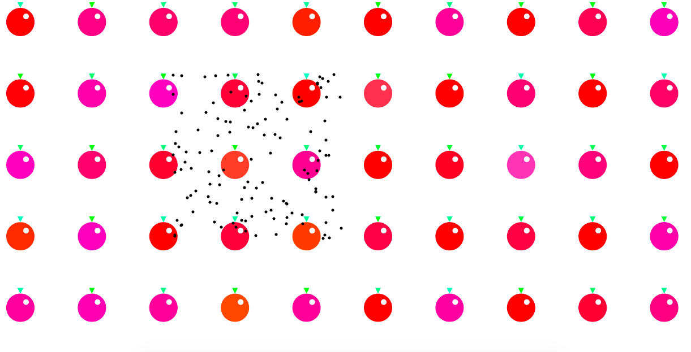

# HW-8 Apples, Lemons, and Fruitflies (For Loops)

[hw-8 live link](https://katholmgren.github.io/120-work/hw-8/)

For this homework cycle, we were to use either while loops or for loops in a sketch. I used for loops to make a sketch that had many points following the mouse position, as well as background shapes set on a grid. I used if statements to control which grid of shapes appeared depending on the mouse position. The background shapes are supposed to be apples and lemons. The moving points are supposed to be fruit flies.

## Steps

I started over many times on this because I couldn't decide what to draw. Even when I chose to draw fruit, I originally started with bananas, apples, oranges, and fruit flies. Then it morphed into apples, lemons, and fruit flies.

Basically, to create the sketch, I started with Setup, declared variables in the draw loop, made an else if statement for apples and lemons, then added fruit flies last in a separate if statement. I used a for loop to make many ellipses in a grid pattern. I also used a for loop to make many "fruit flies".

## Issues

Besides not knowing what to draw for a while, I had a lot of issues with order of operations. The flies would show up behind the fruit, otherwise, they wouldn't show up at all. It also took me a long time to get the stroke to work in the right places without affecting areas I didn't want a stroke. This came down to rearranging things all over the place. Eventually, I got it to show up. The push and pop boxes helped a lot with this homework.

I did not post about these because I knew I had the order the wrong and it was just a matter of copying and pasting things into different spots.

## Conclusion

There are no other things about for loops that I would specifically like to know. They confused me a lot this week, so I really just need more practice. I would also one day like to have the fruit flies leave a white trail that "erases" the fruit. I couldn't figure out how to do this.

Here is a picture of my sketch:

